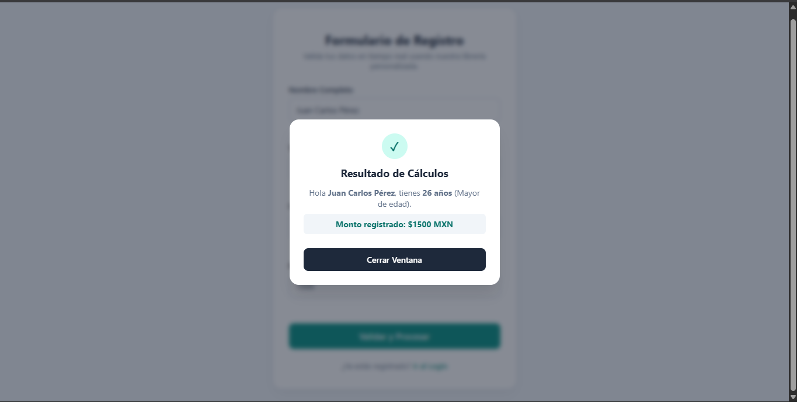
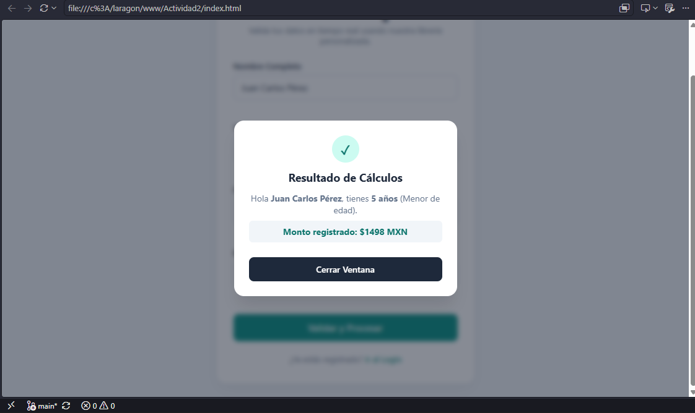
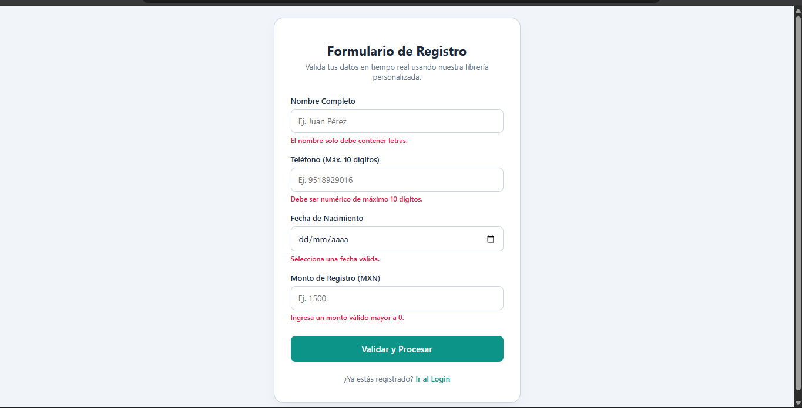
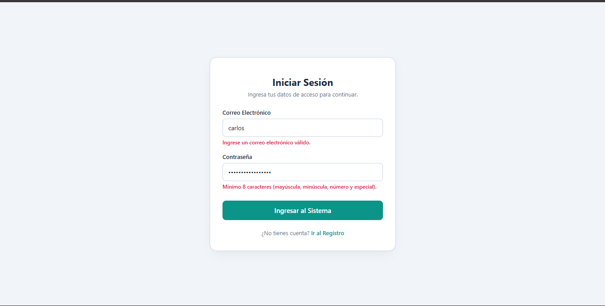

# Librería utileria.js

**Autor:** Carlos Enrique García Unda  
**Materia:** Programación Web  

## Descripción
`utileria.js` es una librería en JavaScript nativo (Vanilla JS) que ofrece herramientas reutilizables para validación de datos en formularios, comprobación de expresiones regulares y cálculos de edad.

---

## Instalación
Agrega la librería dentro del archivo HTML antes de finalizar el tag `</body>`:

```html
<script src="js/utileria.js"></script>
```

---

## Funciones y Ejemplos de Uso

### 1. `validarCorreo(correo)`
Comprueba si la cadena cumple con la estructura estándar de correo.
```javascript
validarCorreo("ejemplo@correo.com"); 
validarCorreo("correo.com");         
```

### 2. `soloLetras(texto)`
Valida que un texto contenga únicamente letras y espacios (acepta acentos).
```javascript
soloLetras("Juan Pérez"); 
soloLetras("Juan123");    
```

### 3. `validarLongitud(numero, maxLongitud)`
Comprueba que la longitud de un valor numérico no exceda el límite definido.
```javascript
validarLongitud(9511234567, 10); 
```

### 4. `calcularEdad(fechaNacimiento)`
Calcula los años cumplidos a partir de la fecha recibida.
```javascript
calcularEdad("2000-05-15"); 
```

### 5. `esMayorDeEdad(fechaNacimiento)`
Determina si la persona tiene 18 años o más.
```javascript
esMayorDeEdad("2000-05-15"); 
```

### 6. `validarPassword(password)`
Valida que la contraseña contenga mayúscula, minúscula, número, carácter especial y mínimo 8 caracteres.
```javascript
validarPassword("Password123!"); 
```

### 7. `limpiarEspacios(texto)` *(Función Propia)*
Remueve espacios excesivos dentro de un texto.
```javascript
limpiarEspacios("   Juan    Pérez   "); 
```

### 8. `generarCodigoUsuario(nombre, fechaNacimiento)` *(Función Propia)*
Crea un identificador único para el usuario extrayendo las primeras tres letras de su nombre, su año de nacimiento y añadiendo un sufijo alfanumérico aleatorio. Útil para generar matrículas o IDs.
```javascript
generarCodigoUsuario("Carlos", "2000-05-15"); 
generarCodigoUsuario("Ana", "1995-10-20");    
```

---

## Capturas de Pantalla






## Demo en Video (60 segundos)
()
